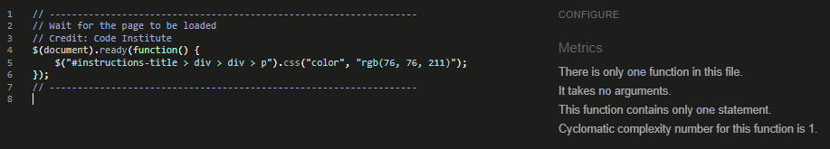

## Sorry, site under construction.

This website will provide a tool for seismic data acquisition companies to use weather data and a blog to plan their operations and interactions with the client.

# **Index**
#### [*Website Live Link*](https://csc7.github.io/PP4_CI_WQCS/)
### [1. Project Goals](#1--project-goals)
### [2. User Experience](#2--user-experience)
- #### [User Goals](#user-goals-1)
- #### [Site Owner Goals](#site-owner-goals-1)
- #### [User Stories](#user-stories-1)
- #### [User Requirements and Expectations](#user-requirements-and-expectations-1)
### [3. Design Choices](#3--design-choices)
- #### [Colours](#colours-1)
- #### [Fonts](#fonts-1)
- #### [Structure](#structure-1)
### [4. Wireframes](#4--wireframes)
### [5. Technologies used](#5--technologies-used)
- #### [Languages](#languages-1)
- #### [Software and Other Tools](#software-and-other-tools-1)
### [6. Features](#6--features)
### [7. Validation](#7--validation)
- #### [HTML Files](#html-files-1)
- #### [CSS File](#css-file-1)
- #### [JavaScript Files](#javascript-files-1)
- #### [Accessibility](#accessibility-1)
- #### [Performance](#performance-1)
### [8. Testing of User Stories](#8--testing-of-user-stories)
### [9. Bugs](#9--bugs)
### [10. Deployment](#10--deployment)
### [11. Credits](#11--credits)
### [12. Acknowledgements](#12--acknowledgements)
  

___
# **1 . Project Goals**
The goal of the project is ...

Specifically, the goals of the project are the following:
- To show ...
- To build ...
- To ...
  
## [Back to Index](#index)
 

___
# **2 . User Experience**

UX has been addressed (and remains as a constant activity) around Jesse James Garrett's process, whose five planes involves the following matters:
- **STRATEGY**: to build a website (product) that creates wavelet signals and gives the option to contact the developer.
- **SCOPE**: the minimum viable product needs to include features that allow the user to know the following:
    - Basic information about the about the functions being implemented (wavelet formulas).
    - A graph of the wavelet, using Google Charts (please see credit below), based on input parameters given by the user.
    - A section where user can input the type of wavelet, sampling rate, length of the signal and its frequency.
    - A "Generate" button.
    - An "Export" button.
    - A quiz with ten questions.
    - A contact form.
- **STRUCTURE**: the information is structured as follows:
    - Wavelet functions, in a separate page called "Functions".
    - Google Chart (please see credit below) graph, input parameters and generate/export buttons in a separate page called "Generator".
    - A quiz with ten questions in a separate page called "Quiz".
    - A contact form in a separate page called "Contact".
    - A fixed navigation bar on top.
    - A fixed footer.
- **SKELETON**: the information is accessed through a fixed navigation menu on top of the pages.
- **SURFACE**: the website is based on red, white and blue colours to give strong contrast and simultaneously a "live" design.

## **User Goals**
- To find an interactive website.
- To navigate through a responsive website.
- To have ...
- To select ...
- To export ...
- To check ...
- To be able to contact the developer if desired.

#### [Back to Index](#index)

## **Site Owner Goals**
- To provide an interactive website.
- To provide a responsive website.
- To provide ...
- To show his work.
- To give users the chance to contact the developer.
- To provide a basic and scalable website and framework for a planning and management system in seismic crews.

#### [Back to Index](#index)
 

## **User Stories**
User stories are divided into the following three groups:

- ### **First time users**
1. As a user, I want to find a responsive website, so I can access it in any device without having the content affected.
2. As a user, I want to find ...
3. As a user, I want to .., so I d...
4. As a user, I want to ..., so I ...
5. As a user, I want to .., so I can have ...
6. As a user, I want to .., so I can ...

- ### **Returning users**
7. As a returning user, I want to..., so I...
8. As a returning user, I want a navigation menu on top and always visible, so I can access any content on the website from there and do not need to use the back button of the browser.
9. As a returning user, I want .., so I do not need to ...
10. As a returning user, I want to.. so I can ...
11. As a returning user, I want to ..., so I ...
12. As a returning user, I want to have a way to send feedback or make consultations, so I can collaborate and/or make consultations about the website and/or its content.
13. As a returning user, I want to be informed if the contact form goes through, so I know if my message is sent or it is not.
14. As a returning user, I want to have a way to contact the developer so I can contribute and/or indicate errors or bugs.

- ### **Site Owner**
15. As owner, I want to create a website that provides a basic ... so users can use it to ...
16. As owner, I want to create a website that is the base for further development, so I can keep showing my work and offer more solutions in the future.
17. As owner, along with other points of this section, I want to show my work and give the option to users to contact me if they wish.
18. As owner, I want to provide a website that can be browsed fully without using the back button, so users have a "map" of the website at all times and do not get issues while navigating (like sending data to a server interrupted or resent).
19. As owner, I want to provide a responsive website, so user can access it from any device without any constraint to navigate, find and/or use the website.
20. As owner, I want to give an interactive website that update colours, graphs and information, so users enjoy the navigation on the website and instantly know if the website works properly or it does not.
21. As owner, I want to put a brand in the top left, so users not only associate the brand with the website but also they can click it for the "home" (Functions) page.
22. As owner, I want to provide a website that ... so users can ...
23. As owner, I want to give an interactive website, so users ...
24. As owner, I want to provide a ... so users can ...
25. As owner, I want to give as many options to be contacted as possible, so users can choose forms or links in the footer to send their consultations and/or feedback in a very fast way without having to navigate through the website.
26. As owner, I want to inform users if they consultation/message was successfully sent, so they know if they need to resend it or they do not.
27. As owner, I want to inform the user, through an error page, if there is any error when loading the website.
28. As owner, I want to validate the contact form and e-mail field ..., so users cannot send empty forms or data, simultaneously letting them know if the form or data is successfully sent.

#### [Back to Index](#index)

## **User Requirements and Expectations**
- A fixed and responsive navigation menu on top.
- A dedicated page for ...
- A dedicated page for ...
- A dedicated page for ...
- A dedicated page for the contact form.
- A fixed footer with contact links to the developer.
- Strong contrast using red, white and blue.
  
## [Back to Index](#index)
 

___
# **3 . Design Choices**

The design was planned to cover screen sizes from 320x568px to 1920x1370px.

## **Colours**
Red, white (as background) and blue is the base of the website. The goal is to provide strong contrast and use colours that show a vivid website.

#### [Back to Index](#index)
 

## **Fonts**
Google fonts (please see credits section below) were implemented on the website. Nunito/Montserrat were selected as the font pair for the website (following Google's suggestion), however only Nunito has been applied.
Sans-serif font is used as a back-up in case the previous font cannot be loaded.

Colour #rgb(98, 98, 161), dark blue, was selected for paragraphs, while red and blue for headings.

#### [Back to Index](#index)
 

## **Structure**
The metadata includes the following keywords to help search engines to find the website: ..., Code Institute, software development, student, full-stack course, milestone project.

The visible website is organised in a header, a body and a footer.

Wireframes were developed at the beginning in order to have a first design of the website.

- ### **Header**

In order to achieve the goals related to easiness and/or simplicity, a fixed navigation area in the header is provided. In the same area, a logo with the idea of the website is place to the left.
The header contains the navigation bar with the four links to the body pages (please see next section).

- ### **Body**

The body of the pages are structured as follows for each of the pages:
- #### *Instructions:*
    It contains a ...
- #### *Weather:*
    It has ...
- #### *Incidence Blog:*
    It contains ...
- #### *Contact:*
    It has a simple contact form, centre-aligned, with name, surname, e-mail and description fields, before it finds the send button.
 
    
- ### **Footer**

The footer contains links for social media (LinkedIn and GitHub) and e-mail. It is designed to remain fixed at the bottom of the webpages in order to have the links always visible to promote the developer of the website.\
  
## [Back to Index](#index)
 

___
# **4 . Wireframes**

Wireframes were developed in order to gather all goals, user stories, requirements and expectations, and have the design references for desktop, tablet and mobile devices.
Please check the PDFs files for each case in the following links:

    
Desktop Wireframe Image for Functions Page

    
Desktop Wireframe Image for Generator Page

    
Desktop Wireframe Image for Quiz Page

    
Desktop Wireframe Image for Contact Page

    
Tablet Wireframe Image for Functions Page

    
Tablet Wireframe Image for Generator Page

    
Tablet Wireframe Image for Quiz Page

    
Tablet Wireframe Image for Contact Page

    
Cell Wireframe Image for Functions and Generator Pages

    
Cell Wireframe Image for Quiz and Contact Pages

 

[PDF File for Desktop Wireframe](docs/wireframes/wireframe-desktop.pdf)

[PDF File for Tablet Wireframe](docs/wireframes/wireframe-tablet.pdf)

[PDF File for Cell Wireframe](docs/wireframes/wireframe-cell.pdf)
  
## [Back to Index](#index)
 

___
# **5 . Technologies Used**

The following languages, software and tools were implemented using Windows 10 Pro:
## **Languages**
- #### **HTML**
- #### **CSS**
- #### **JavaScript**

#### [Back to Index](#index)

## **Software and Other Tools**
- #### **GitHub**
- #### **Gitpod**
- #### **Font Awesome (v5.15)**
- #### **Bootstrap (v4.0)**
- #### **EmailJS**
- #### **Balsamiq Wireframes (v4.2.4, Editor Version 2.6.0)**
- #### **Google Fonts**
- #### **MATLAB, The MathWorks, Inc. (to generate function plots in Functions page and obtain Morlet function)**
- #### **W3C Markup Validation Service**
- #### **W3C CSS Validation Service**
- #### **JSHint (version 2.13.0)**
- #### **WAVE Web Accessibility Evaluation Tool**
- #### **Google Lighthouse (used in Google, Microsoft Edge and Firefox)**
- #### **Google Chrome, version 91.0.4472.114, Official Build, 64-bit (and its development tool)**
- #### **Microsoft Edge, version 91.0.864.59, Official build, 64-bit (and its development tool)**
- #### **Firefox, 89.0.2, 64-bit (and its development tool)**
- #### **Microsoft Internet Explorer, version 2004, OS Build 19041.1052**
- #### Babel JavaScript compiler (transpiler, to try to solve ES5 issues for Internet Explorer, finally not implemented, https://babeljs.io/docs/en/babel-standalone).
  
## [Back to Index](#index)

___
# **6 . Features**

The website consists of four pages, where each of them is divided in three parts: header, body and footer. The features contained in each of the pages and parts are the following ones:

- ### **Website logo**

It is located in all pages, fixed, top-left, and always visible.

*User Stories Addressed by this Feature: 8; ... and 21.*

*Please check "8. Testing of User Stories" for more details.*

    
Check Image

 

- ### **Fixed navigation menu**

It is located in the header, fixed on all pages to facilitate navigation, and responsive.

*User Stories Addressed by this Feature: 8; ... and 21.*

*Please check "8. Testing of User Stories" for more details.*

    
Check Image

 

- ### **Instructions**

They can be found in the Instructions page (home), they explain how to use the weather and blog pages.

*User Stories Addressed by this Feature: 8; ... and 21.*

*Please check "8. Testing of User Stories" for more details.*

    
Check Images

 

- ### **Contact Form**

It can be found in the Contact page and allows users to contact the website developer. It prevents the form to be sent with incomplete fields, informs the user if the message goes through and disables the send button in order not to send the consultation more than once.

*User Stories Addressed by this Feature: 8; ... and 21.*

*Please check "8. Testing of User Stories" for more details.*

    
Check Image

 

- ### **Footer**

It is located at the bottom of all pages, containing icons with links to LinkedIn, GitHub and e-mail application (to automatically load developer's e-mail address in the addressee field).

*User Stories Addressed by this Feature: 8; ... and 21.*

*Please check "8. Testing of User Stories" for more details.*

    
Check Image

 

- ### **404 page**

It is a different page that appears in case there is any issue when loading the page, like a similar incorrect URL. It contains a light red background and contains the message *"Sorry, something went wrong."*.

*User Stories Addressed by this Feature: 8; ... and 21.*

*Please check "8. Testing of User Stories" for more details.*

    
Check Image

  
## [Back to Index](#index)
 

___
# **7 . Validation**

The introductory image on top of this README file was generated using the [Am I Responsive site](http://ami.responsivedesign.is/?url=https%3A%2F%2Fcsc7.github.io%2FPP1_CI_TGC) to test how the website displays in different screen sizes.

**Development tools** of **Google Chrome** (Version 92.0.4515.131, Official Build, 64-bit), **Microsoft Edge** (Version 92.0.902.67, Official build, 64-bit) and **Firefox** (Version 90.0.2, 64-bit) have been used to test the behaviour of the website for screen sizes between 320x568px to 1920x1370px.

The website was tested using these **browsers** and also **Microsoft Internet Explorer** (Version 2004, OS Build 19041.1165). **Samsung Internet** (version 14.0.1.62) was also used to test the website. In addition, some users have collaborated checking the website in the cell phones, mostly with **Android-based operating systems**.

**Devices** used for testing and validation include Dell and Toshiba laptops, Samsung cell phones. **Operative systems** include Windows 10 Enterprise (remote desktop), Windows 10 Pro, Windows 10 Home and Android. **Processors** for desktop and laptops were Intel.

The following tools were used to validate the **files of the website**:

## **HTML Files**
https://validator.w3.org/ was used to validate the HTML files. All files ended up with zero errors and warnings.
Please check the evidence below:

    
Functions Page

 

    
Generator Page

    
Quiz Page

 

    
Contact Page

 

    
404 Page

 

#### [Back to Index](#index)

 

## **CSS File**
https://jigsaw.w3.org/css-validator/ was used to validate the CSS file.
Please check the evidence below:

    

            

     

    
CSS Filee

 

#### [Back to Index](#index)

  

## **JavaScript Files**
https://jshint.com/ was used to validate the JavaScript files.
Please check the parameters used for validation and evidence below:

    
Parameters used for JavaScript validation in JSHint version 2.13.0

 

    
Functions Page

 

    
Generator Page. Plase note that dataForGoogleChartFunction, google and emailjs are external variable from Google (the first two) and EmailJS (the third); while sendData is the function that is called from the Generator page to send the graph data by e-mail.

    
Quiz Page

 

    
Contact Page. Plase note that emailjs is an external variable from EmailJS; while sendMail is the function that is called from the Contact page to send the form.

 

#### [Back to Index](#index)

 

## **Accessibility**
https://wave.webaim.org/ was used to validate accessibility. Although there are warnings, all pages contains zero errors. Please check evidence below:

    
Functions Page

 

    
Generator Page

    
Quiz Page

 

    
Contact Page

 

    
404 Page

 

#### [Back to Index](#index)

 

## **Performance**
Google Lighthouse (used in Google, Microsoft Edge and Firefox) were used to evaluate the performance of the pages. Please check the results below:

    
Functions Page for Cell Phones(93)

 

    
Functions Page for Desktop (99)

 

    
Generator Page for Cell Phones(97)

    
Generator Page for Desktop (100)

    
Quiz Page for Cell Phones(95)

 

    
Quiz Page for Desktop (99)

 

    
Contact Page for Cell Phones(97)

 

    
Contact Page for Desktop (100)

 

    
404 Page for Cell Phones(92)

 

    
404 Page for Desktop (100)

 

  
## [Back to Index](#index)
 

___
# **8 . Testing of User Stories**

## **First time users**

The following are testing of User Stories previously described above:
  

1. As a user, I want to find a responsive website, so I can access it in any device without having the content affected.

| FEATURE | ACTION | EXPECTED RESULT | ACTUAL RESULT |
| --- | --- | --- | --- |
| Website | Design of pages and their visualization adapt to different screen sizes | Different designs in different devices showing correctly | Works as expected | 

    
Screenshot

 

  

2. As a user, I want ..., so I ...

  

## [Back to Index](#index)
 

___
# 9 . Bugs

Some bugs were related to positioning of elements in the page. They were fixed by assigning proper values, most of them with the help of a temporary background colour for the element.

Then, many minor bugs were solved just by assigning the correct property and/or by trial and error.

Bugs that required more time and specific solutions were the following ones:

| Bug | Solution |
| ---- | ---- |
| The ... | The issue was caused ... Solved with **Therefore**... | 
| The ... | The issue could be solved by ...|

  
## [Back to Index](#index)
 

___
# 10 . Deployment

The website was fully written in Gitpod, permanently tested with Gitpod preview, and periodically deployed to GigHub Pages (in a main branch).

The fully deployed website, accessible by anyone, is found [here](https://csc7.github.io/PP2_CI_WW), whose URL is https://csc7.github.io/PP2_CI_WW . Its repository is found [here](https://github.com/csc7/PP4_CI_WQCS), whose URL is https://github.com/csc7/PP2_CI_WW.

Based on the Code Institute's Love Running project content, the following steps has been applied to have the front-end final version deployed:
1. Select website repository in GitHub account.
2. Go to "Settings" (up in the menu, to the right).
3. Select "Pages" in the menu on the left.
4. At the beginning, in "Source", select "Branch: main", and click "Save".
5. The URL address of the deployed website will appear on top of the page, as can be observed in the screenshot below in the drop-down item.

    
GitHub Pages Screenshot

 

\
After first deployment, several updates have been carried out before the final version. These updates were implemented in the deployed website from Gitpod, just by using the "push" command for every commit (change) in the ongoing development.

The project can also be forked from the repository (https://github.com/csc7/PP2_CI_WW), please check for the "Fork" button, top-right of the page, to achieve this task.

  
## [Back to Index](#index)
 

___
# 11 . Credits

- Code Institute: I have used the learning material in the course as a guide and reference.

- Love Maths - Essentials Project, from Code Institute, as a guide, source of design, concepts and code for this project, especially for the Quiz page.

- Love Running - Essentials Project, from Code Institute, as a guide, source of design, concepts and code for this project.

- Balsamiq Wireframes: I have used it to create all the wireframes.

- Jesse James Garrett's process for user experience.

- Babel JavaScript compiler (transpiler, to try to solve ES5 issues for Internet Explorer, finally not implemented, https://babeljs.io/docs/en/babel-standalone). Tested on August 6th, 2021, between 5:30 and 6:30 approximately.

- Bootstrap:

    - Bootstrap Navbar, copied from https://getbootstrap.com/docs/4.0/components/navbar/ on July 8th, 2021, at 00:35, and December 7th, 2021, 04:00; menu content modified.

    - Bootstrap CSS link: code copied on December 7th, 2021, 01:50 from Code Institute lessons; "<link rel="stylesheet" href="https://maxcdn.bootstrapcdn.com/bootstrap/4.1.3/css/bootstrap.min.css">"

    - Bootstrap Scripts - copied on December 7th, 2021, 06:21 from https://getbootstrap.com/docs/4.0/getting-started/introduction/ .

    - Bootstrap Navs (for footer): Copied on December 7th, 2021, 05:00 from https://getbootstrap.com/docs/4.0/components/navs/; content modified.

    - To centre elements in Navs and Navbar: justify-content-center class. Copied on July 8th, 2021, 03:43 from https://getbootstrap.com/docs/4.0/components/navs/ .

    - Button trigger modal: code copied on December 7th, 2021, 08:34 from https://getbootstrap.com/docs/4.0/components/modal/; content modified.

- Font Awesome:

    - Font Awesome Script / Kit, link copied on December 7th, 2021, 05:07 from Font Awesome personal account.

    - Icon for LinkedIn: link copied on December 7th, 2021, 05:50 from https://fontawesome.com/v5.15/icons/linkedin?style=brands (<i class="fab fa-linkedin"></i>).

    - Icon for GitHub: link copied on December 7th, 2021, 05:52 from https://fontawesome.com/v5.15/icons/github-square?style=brands (<i class="fab fa-github-square"></i>).

    - Icon for E-mail/Envelope: link copied on December 7th, 2021, 05:53 from https://fontawesome.com/v5.15/icons/envelope-square?style=solid (<i class="fas fa-envelope-square"></i>).

    - Icon for website logo (wind), downloaded on December 7th, 2021, 09:15, from https://fontawesome.com/v5.15/icons/wind?style=solid .

- Google:

    - Google Fonts: Heebo (Medium 500) and Oxygen (Regular 400), first imported on December 7th, 2021, 08:01, from: https://fonts.google.com/; ().

- MDN Web Docs Moz://a;
    - ...

- Stack Overflow:

    - ..: https://stackoverflow.com/...; accessed on ..., 2021, at 00:30.

    - ...

- W3C®. Copyright © 2021 W3C ® (MIT, ERCIM, Keio, Beihang):
    - How to introduce author in anchor element: https://www.w3.org/TR/2011/WD-html5-author-20110809/the-link-element.html, accessed on August 4th, 2021, at 00:06.

- W3Schools (Powered by W3.CSS):

    - ...: https://www.w3schools.com/...; accessed on ..., 2021, at 23:55.

## [Back to Index](#index)
___
# 12 . Acknowledgements

I would like to acknowledge and thank the following people for being part of this project and for helping me in the development of it:
- To my wife and family, for always supporting and helping.
- Code Institute, for providing knowledge, guide, content and tools.
- My mentor, Mo, for helping with very valuable guide and support.
- Code Institute community in Slack for permanently being an online reference.
- All the valuable information provided by the sources mentioned above in the credits.

  
## [Back to Index](#index)
 